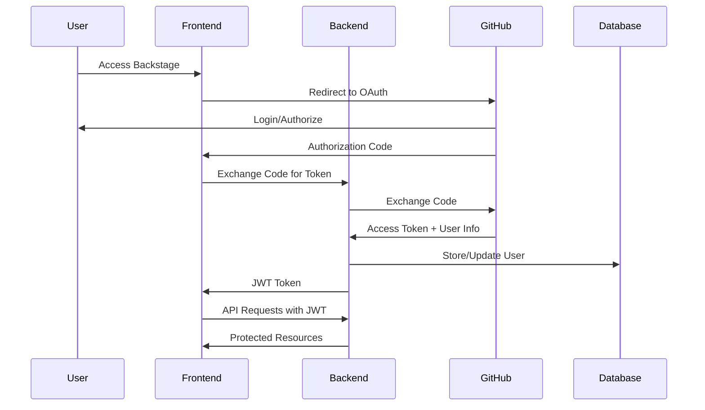
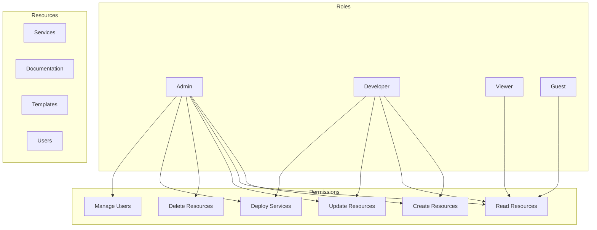

# ADR-003: Authentication and Authorization Strategy

## Status

**Accepted** - 2024-01-01

## Context

The ULP platform needs a robust authentication and authorization system that can:

- Secure access to the Backstage developer portal
- Protect API endpoints across all services
- Support multiple authentication methods
- Provide fine-grained access control
- Integrate with existing identity providers
- Scale with the organization's growth

## Decision

We will implement a **multi-layered authentication and authorization strategy** using:

1. **OAuth 2.0 + JWT** for API authentication
2. **GitHub OAuth** for Backstage portal access
3. **RBAC (Role-Based Access Control)** for authorization
4. **API Keys** for service-to-service communication

## Rationale

### Why OAuth 2.0 + JWT?

1. **Industry Standard**: Widely adopted and well-understood
2. **Stateless**: JWT tokens don't require server-side storage
3. **Scalable**: Works well in distributed systems
4. **Flexible**: Supports multiple grant types and flows
5. **Security**: Strong cryptographic guarantees

### Why GitHub OAuth for Backstage?

1. **Developer Familiarity**: Most developers already have GitHub accounts
2. **Integration**: Seamless integration with GitHub-based workflows
3. **Organization Support**: GitHub organizations for team management
4. **Permission Scopes**: Fine-grained permission control
5. **No Additional Infrastructure**: Leverages existing GitHub infrastructure

### Why RBAC?

1. **Scalable**: Easy to manage permissions as organization grows
2. **Flexible**: Can model complex organizational structures
3. **Auditable**: Clear permission trails for compliance
4. **Maintainable**: Centralized permission management

## Architecture

### Authentication Flow



### Authorization Model



## Implementation Details

### JWT Token Structure

```json
{
  "header": {
    "alg": "RS256",
    "typ": "JWT"
  },
  "payload": {
    "sub": "user123",
    "name": "John Doe",
    "email": "john@example.com",
    "roles": ["developer"],
    "teams": ["team-ulp"],
    "permissions": ["read", "create", "update"],
    "iat": 1640995200,
    "exp": 1641081600,
    "iss": "ulp-platform"
  }
}
```

### Role Definitions

#### Admin Role
- **Description**: Full platform access and management
- **Permissions**: All permissions
- **Use Cases**: Platform administrators, security team
- **Access**: All services, all documentation, user management

#### Developer Role
- **Description**: Standard development access
- **Permissions**: Create, read, update, deploy
- **Use Cases**: Software developers, DevOps engineers
- **Access**: Services, documentation, templates (no user management)

#### Viewer Role
- **Description**: Read-only access
- **Permissions**: Read only
- **Use Cases**: Stakeholders, external partners
- **Access**: Services, documentation (no modifications)

#### Guest Role
- **Description**: Limited access
- **Permissions**: Read only (limited scope)
- **Use Cases**: External users, temporary access
- **Access**: Public documentation only

### API Key Management

#### Service-to-Service Authentication

```yaml
# API Key configuration
api_keys:
  python-app:
    key: "sk-1234567890abcdef"
    permissions: ["read", "write"]
    expires: "2024-12-31T23:59:59Z"
  
  monitoring-service:
    key: "sk-fedcba0987654321"
    permissions: ["read"]
    expires: "2024-12-31T23:59:59Z"
```

#### Key Rotation Strategy

1. **Automatic Rotation**: Keys rotate every 90 days
2. **Grace Period**: 7-day overlap for seamless transition
3. **Notification**: 30-day advance notice before rotation
4. **Emergency Rotation**: Immediate rotation for compromised keys

## Security Considerations

### Token Security

1. **Short Expiration**: JWT tokens expire in 1 hour
2. **Refresh Tokens**: 30-day refresh tokens for seamless experience
3. **Secure Storage**: Tokens stored in httpOnly cookies
4. **HTTPS Only**: All authentication over HTTPS
5. **Token Validation**: Server-side validation on every request

### API Key Security

1. **Encrypted Storage**: Keys encrypted at rest
2. **Access Logging**: All API key usage logged
3. **Rate Limiting**: Per-key rate limiting
4. **Scope Limitation**: Keys limited to necessary permissions
5. **Regular Rotation**: Automatic key rotation

### Session Management

1. **Session Timeout**: 8-hour inactivity timeout
2. **Concurrent Sessions**: Maximum 3 concurrent sessions per user
3. **Device Tracking**: Track and manage device sessions
4. **Logout Everywhere**: Ability to invalidate all sessions

## Integration Points

### Backstage Integration

```yaml
# Backstage auth configuration
auth:
  providers:
    github:
      clientId: ${GITHUB_CLIENT_ID}
      clientSecret: ${GITHUB_CLIENT_SECRET}
      callbackUrl: ${BACKEND_URL}/auth/github/callback
  session:
    secret: ${SESSION_SECRET}
    cookie:
      secure: true
      httpOnly: true
      sameSite: 'strict'
```

### API Integration

```python
# Python API authentication middleware
from functools import wraps
from flask import request, jsonify
import jwt

def require_auth(f):
    @wraps(f)
    def decorated_function(*args, **kwargs):
        token = request.headers.get('Authorization')
        if not token:
            return jsonify({'error': 'No token provided'}), 401
        
        try:
            data = jwt.decode(token, public_key, algorithms=['RS256'])
            request.user = data
        except jwt.ExpiredSignatureError:
            return jsonify({'error': 'Token expired'}), 401
        except jwt.InvalidTokenError:
            return jsonify({'error': 'Invalid token'}), 401
        
        return f(*args, **kwargs)
    return decorated_function
```

## Migration Strategy

### Phase 1: Basic Authentication (Weeks 1-2)
- Implement JWT token generation and validation
- Set up GitHub OAuth for Backstage
- Create basic role system

### Phase 2: RBAC Implementation (Weeks 3-4)
- Implement role-based permissions
- Create user management interface
- Set up API key management

### Phase 3: Integration (Weeks 5-6)
- Integrate authentication across all services
- Set up monitoring and logging
- Implement security policies

### Phase 4: Advanced Features (Weeks 7-8)
- Implement token refresh mechanism
- Set up API key rotation
- Add audit logging and compliance features

## Monitoring and Compliance

### Security Monitoring

1. **Failed Login Attempts**: Alert on multiple failed attempts
2. **Token Anomalies**: Monitor for unusual token usage patterns
3. **API Key Abuse**: Track API key usage and detect abuse
4. **Permission Escalation**: Monitor for unauthorized permission changes

### Audit Logging

```json
{
  "timestamp": "2024-01-01T12:00:00Z",
  "event": "user_login",
  "user_id": "user123",
  "ip_address": "192.168.1.100",
  "user_agent": "Mozilla/5.0...",
  "success": true,
  "session_id": "sess_abc123"
}
```

### Compliance Features

1. **GDPR Compliance**: User data export and deletion
2. **SOX Compliance**: Audit trail for financial systems
3. **SOC 2**: Security controls and monitoring
4. **Data Retention**: Configurable data retention policies

## Success Metrics

- **Security**: Zero unauthorized access incidents
- **Performance**: < 100ms authentication overhead
- **Availability**: 99.9% authentication service uptime
- **User Experience**: < 3 seconds login time
- **Compliance**: 100% audit log coverage

## Future Considerations

### Planned Enhancements

1. **Multi-Factor Authentication**: TOTP and SMS support
2. **Single Sign-On**: SAML and LDAP integration
3. **Advanced RBAC**: Attribute-based access control
4. **Zero Trust**: Continuous verification and validation

### Technology Roadmap

- **Q1 2024**: MFA implementation
- **Q2 2024**: SSO integration
- **Q3 2024**: Advanced RBAC
- **Q4 2024**: Zero Trust architecture

## Review

This ADR will be reviewed in 6 months to assess:
- Security effectiveness
- User adoption and satisfaction
- Performance and scalability
- Need for additional features

---

**Previous ADR**: [ADR-002: Database Selection](./adr-002-database-selection.md)  
**Next ADR**: [ADR-004: Monitoring Strategy](./adr-004-monitoring-strategy.md)
