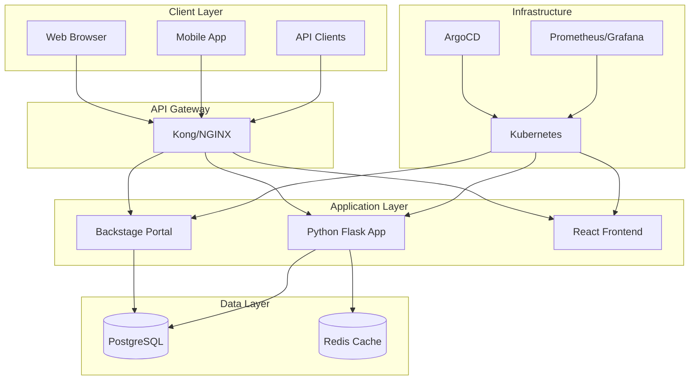
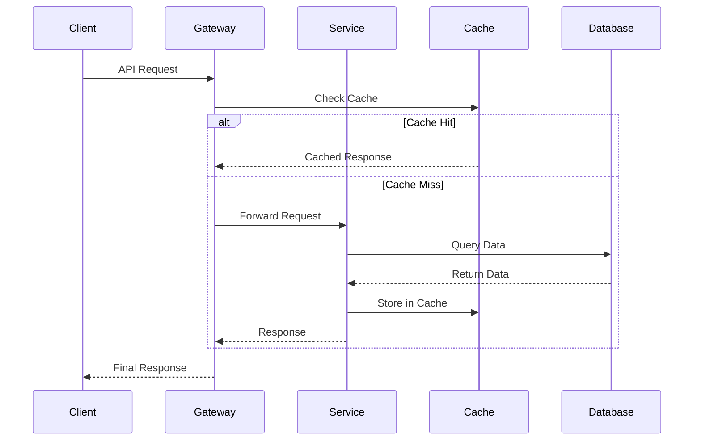
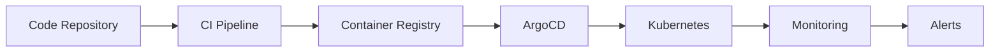

# Architecture Documentation

This document describes the overall architecture of the ULP platform and its components.

## System Overview

The ULP (Ultimate Learning Platform) is built as a microservices architecture with the following key principles:

- **Microservices**: Loosely coupled, independently deployable services
- **API-First**: All services expose well-defined APIs
- **Cloud-Native**: Designed for containerized deployment
- **Observability**: Comprehensive monitoring and logging
- **Security**: Defense in depth with multiple security layers

## Architecture Diagram

## Core Components

### 1. Backstage Developer Portal

**Purpose**: Central hub for service discovery, documentation, and development workflows.

**Technology Stack**:
- Node.js with TypeScript
- React frontend
- PostgreSQL database
- Docker containerization

**Key Features**:
- Service catalog
- Documentation management
- Software templates
- API discovery
- Team collaboration

### 2. Python Flask Application

**Purpose**: Core business logic and API services.

**Technology Stack**:
- Python 3.11+
- Flask web framework
- SQLAlchemy ORM
- PostgreSQL database
- Redis for caching

**Key Features**:
- RESTful API endpoints
- Health checks
- Metrics collection
- Authentication/authorization

### 3. Frontend Application

**Purpose**: User interface for end users.

**Technology Stack**:
- React 18
- TypeScript
- Material-UI components
- Vite build tool

**Key Features**:
- Responsive design
- Real-time updates
- Progressive Web App (PWA)
- Accessibility compliance

## Data Architecture

### Database Design

#### PostgreSQL (Primary Database)

**Tables**:
- `users` - User accounts and profiles
- `services` - Service registry
- `deployments` - Deployment history
- `metrics` - Performance metrics
- `audit_logs` - Security audit trail

#### Redis (Caching Layer)

**Use Cases**:
- Session storage
- API response caching
- Rate limiting counters
- Real-time data

### Data Flow

## Security Architecture

### Authentication & Authorization

1. **OAuth 2.0 + JWT**: Primary authentication mechanism
2. **RBAC**: Role-based access control
3. **API Keys**: For service-to-service communication
4. **Multi-factor Authentication**: For sensitive operations

### Network Security

1. **TLS Everywhere**: All communications encrypted
2. **Network Policies**: Kubernetes network segmentation
3. **Firewall Rules**: Restrictive ingress/egress
4. **VPN Access**: Secure remote access

### Data Protection

1. **Encryption at Rest**: Database encryption
2. **Encryption in Transit**: TLS 1.3
3. **Secrets Management**: Kubernetes secrets + external vault
4. **Data Masking**: PII protection in logs

## Deployment Architecture

### Kubernetes Cluster

**Node Types**:
- **Control Plane**: 3 nodes for high availability
- **Worker Nodes**: Auto-scaling based on demand
- **Edge Nodes**: For ingress and load balancing

**Namespaces**:
- `backstage`: Backstage portal
- `dev-portal`: Development environment
- `monitoring`: Observability stack
- `argocd`: GitOps deployment

### GitOps Workflow

## Monitoring & Observability

### Metrics Collection

- **Prometheus**: Metrics scraping and storage
- **Grafana**: Visualization and dashboards
- **Custom Metrics**: Business-specific KPIs

### Logging

- **Fluentd**: Log collection and forwarding
- **Elasticsearch**: Log storage and indexing
- **Kibana**: Log analysis and search

### Tracing

- **Jaeger**: Distributed tracing
- **OpenTelemetry**: Instrumentation standard
- **Trace Analysis**: Performance bottleneck identification

## Scalability Considerations

### Horizontal Scaling

- **Stateless Services**: All services designed to be stateless
- **Load Balancing**: Multiple instances behind load balancer
- **Database Sharding**: Horizontal database partitioning
- **Caching Strategy**: Multi-level caching implementation

### Vertical Scaling

- **Resource Limits**: Kubernetes resource requests/limits
- **Auto-scaling**: HPA and VPA for automatic scaling
- **Performance Tuning**: Database and application optimization

## Disaster Recovery

### Backup Strategy

- **Database Backups**: Daily automated backups
- **Configuration Backups**: Git-based configuration management
- **Container Images**: Multi-region registry replication

### Recovery Procedures

1. **RTO (Recovery Time Objective)**: 4 hours
2. **RPO (Recovery Point Objective)**: 1 hour
3. **Failover Process**: Automated failover to secondary region
4. **Data Restoration**: Point-in-time recovery capability

## Technology Decisions

### Why These Technologies?

#### Backstage
- **Mature Platform**: Battle-tested by Spotify and others
- **Extensibility**: Rich plugin ecosystem
- **Community**: Strong open-source community

#### Python Flask
- **Simplicity**: Easy to understand and maintain
- **Flexibility**: Minimal constraints, maximum control
- **Ecosystem**: Rich library ecosystem

#### Kubernetes
- **Industry Standard**: De facto standard for container orchestration
- **Scalability**: Handles large-scale deployments
- **Ecosystem**: Rich ecosystem of tools and operators

#### PostgreSQL
- **ACID Compliance**: Strong consistency guarantees
- **Performance**: Excellent query performance
- **Features**: Rich feature set for complex queries

## Future Considerations

### Planned Improvements

1. **Service Mesh**: Istio for advanced traffic management
2. **Event Streaming**: Apache Kafka for event-driven architecture
3. **Machine Learning**: ML pipeline integration
4. **Multi-Cloud**: Cloud-agnostic deployment strategy

### Technology Roadmap

- **Q1 2024**: Service mesh implementation
- **Q2 2024**: Event streaming platform
- **Q3 2024**: ML/AI capabilities
- **Q4 2024**: Multi-cloud deployment

## References

- [Backstage Documentation](https://backstage.io/docs)
- [Kubernetes Documentation](https://kubernetes.io/docs)
- [Flask Documentation](https://flask.palletsprojects.com/)
- [PostgreSQL Documentation](https://www.postgresql.org/docs/)
